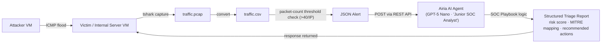

# AI-Augmented SOC Home Lab — Network Anomaly Detection with Airia AI

A hands-on home lab combining a custom Python network-monitoring script with an AI agent (built on **Airia.ai**, powered by **GPT-5 Nano**) that acts as a Tier-1 SOC analyst — automatically triaging alerts, scoring risk, mapping activity to MITRE ATT&CK, and producing analyst-ready reports.

---

## Overview

Most home labs either focus on attack simulation (VMs, payloads, exploitation) or on AI chatbot demos — rarely both. This project links the two: a victim VM runs a lightweight Python detector that watches live traffic, and when it spots abnormal volume from a host, it packages the evidence as a JSON alert and hands it off to an AI agent for triage — the same kind of decision a junior SOC analyst would make when picking up a new alert.

The goal was to understand, hands-on, how AI-assisted alert triage pipelines are actually wired together — useful context for SOC Analyst and VAPT roles, where AI-assisted tooling is becoming part of day-to-day workflows.

---

## Architecture



**Lab setup:** two VMs — one **Attacker** machine used purely to generate traffic, and one **Victim / Internal Server** that hosts the detection script and talks to Airia.

---

## Components

### 1. Victim / Internal Server (VM)
Runs the Python detection script in the background. This is the machine being "defended" and the only one with the Airia API key.

### 2. Attacker (VM)
A separate VM used to generate traffic for the lab to react to. For this run, a simple **ICMP ping flood** was used to keep the proof-of-concept simple — the same pipeline works for other patterns (port scans, brute-force attempts) by adjusting the capture filter and threshold logic.

### 3. Detection / Automation Script (Python)
- Captures live ICMP traffic for a fixed window using `tshark`
- Converts the capture (`.pcap`) to CSV
- Counts packets per source IP and flags any IP that crosses a threshold (40 packets in this run)
- Builds a structured JSON alert (alert ID, source IP, destination host/IP, packet count, time window)
- Sends the alert to Airia's Agent Execution API via a `POST` request, authenticated with an API key header
- API URL/key and capture settings are loaded from environment variables (`.env`), not hardcoded — keeps secrets out of the committed code

### 4. AI Agent — Airia.ai
- **Platform:** [airia.ai](https://airia.ai) — a no-code AI agent orchestration platform
- **Model:** GPT-5 Nano (OpenAI) — picked for low cost (~$0.05 / 1M input tokens, $0.4 / 1M output tokens) and speed, which is enough for a structured, rules-driven triage task rather than open-ended reasoning
- **Agent persona:** "Junior SOC Analyst"
- The agent's entire behavior is governed by a custom **SOC playbook** (see below) supplied as its operating instructions — no fine-tuning involved, just a tightly scoped system prompt.

### 5. SOC Playbook (the agent's "brain")
The playbook (`docs/soc_playbook.txt` in this repo) defines a strict, repeatable triage process:
- **Input validation** — confirms the alert JSON has all required fields before doing anything else
- **Threat classification** — buckets the activity into a fixed set of categories (brute force, recon/scanning, suspicious volume, possible malware comms, benign noise, unknown) — no inventing context beyond what's in the alert
- **Risk scoring (0–100)** — additive scoring based on packet count, repetition window, and target sensitivity, mapped to Low / Medium / High / Critical
- **MITRE ATT&CK mapping** — tags the activity with a tactic/technique where confident (e.g. T1110 Brute Force, T1046 Network Service Scanning), and explicitly says "uncertain" rather than guessing
- **Action plan** — recommends realistic Tier-1 actions (monitor, enrich, block IP, escalate, isolate host) scaled to the risk level
- **Escalation logic** — automatic escalation/containment recommendation above a risk threshold
- **Executive summary** — a 2–3 sentence, jargon-free explanation of business impact
- **Guardrails** — the agent is explicitly restricted to defensive analysis only: no attack instructions, no exploit code, no fabricated intel, no assumed attacker intent
- **Strict JSON output** — every response follows one fixed schema, making it easy to log, store, or feed into another system

### 6. AI Model Configuration
GPT-5 Nano was added to the Airia project as the agent's reasoning model:

| Setting | Value |
|---|---|
| Provider | OpenAI |
| Model | `gpt-5-nano` |
| Context window | 400K tokens |
| Max output | 128K tokens |
| Input cost | $0.05 / 1M tokens |
| Output cost | $0.4 / 1M tokens |

---

## Workflow

1. **Build the agent** on airia.ai — attach the GPT-5 Nano model, paste the SOC playbook in as the agent's instructions, publish the agent to get an API endpoint + key.
2. **Deploy the script** to the victim VM with the API URL and key filled in.
3. **Run the script** — it starts a timed `tshark` capture on the chosen interface.
4. **Generate traffic** from the attacker VM toward the victim (ICMP flood for this test).
5. The script converts the capture → CSV → counts packets per IP → builds a JSON alert once the threshold is crossed → sends it to Airia.
6. The Airia agent runs the alert through the playbook and returns a structured JSON triage report.
7. The response is printed back to the internal server's console for review.

---

## Getting Started

1. **Set up two VMs** on the same network — one as the attacker, one as the victim/internal server.
2. On the victim VM, install `tshark` and Python 3, then clone this repo and install dependencies:
   ```bash
   sudo apt install tshark python3-pip
   git clone <your-repo-url>
   cd ai-soc-homelab
   pip install -r requirements.txt
   ```
3. **Build your own Airia agent**: sign up at [airia.ai](https://airia.ai), create a project, add a model (GPT-5 Nano or similar), paste in `docs/soc_playbook.txt` as the agent's instructions, then publish it to get an API endpoint and key.
4. Configure your environment:
   ```bash
   cp .env.example .env
   # edit .env with your Airia API URL/key and your victim machine's IP
   ```
5. Run the capture script on the victim VM:
   ```bash
   sudo python3 soc_capture.py
   ```
6. From the attacker VM, generate traffic toward the victim, e.g.:
   ```bash
   ping -c 60 <victim_ip>
   ```
7. Watch the victim VM's terminal — once the packet threshold is crossed, it builds the alert and prints Airia's triage response.

---

## Sample Alert Sent to Airia

```json
{
    "alert_id": "SOC-7F3A21C9",
    "alert_type": "Suspicious Network Volume",
    "indicator_type": "ip",
    "indicator_value": "<attacker_ip>",
    "destination_host": "Internal-server",
    "destination_ip": "192.168.0.206",
    "evidence": {
        "packet_count": 50,
        "time_window_seconds": 100,
        "data_source": "traffic.pcap"
    },
    "analyst_question": "Is this expected activity or suspicious scanning/noise?"
}
```

## Output Schema Returned by the Agent (per playbook)

```json
{
  "alert_id": "",
  "threat_classification": "",
  "risk_score": 0,
  "risk_level": "",
  "confidence_level": "",
  "mitre_mapping": {
    "tactic": "",
    "technique_id": "",
    "technique_name": ""
  },
  "analysis_reasoning": "",
  "recommended_actions": [],
  "escalation_required": false,
  "executive_summary": ""
}
```

---

## Tech Stack

- **Python 3** — automation/orchestration (`subprocess`, `requests`, `csv`, `json`)
- **tshark / Wireshark** — packet capture and field extraction
- **VirtualBox** (or equivalent) — 2× Linux VMs (attacker + victim)
- **Airia.ai** — AI agent orchestration platform
- **OpenAI GPT-5 Nano** — the model behind the "Junior SOC Analyst" agent

---

## Key Skills Demonstrated

- Network traffic capture and analysis (pcap → CSV → IP frequency analysis)
- Threshold-based anomaly detection logic, written from scratch in Python
- REST API integration between a custom script and a third-party AI platform
- Security playbook / prompt engineering — translating SOC triage logic (risk scoring, escalation rules, MITRE mapping) into a strict, machine-readable process
- Practical understanding of the MITRE ATT&CK framework
- Early exposure to "agentic SOC" tooling — a growing area as security teams adopt AI-assisted triage

---

## Limitations & Next Steps

- Detection logic is a simple packet-count threshold — easy to evade and prone to false positives. A production setup would use a real SIEM/IDS (e.g. **Wazuh**, Suricata, Zeek) for correlation instead of a hand-rolled script.
- Only an ICMP flood was tested so far. Next: SSH/RDP brute-force and `nmap` scan scenarios to exercise more of the playbook's classification logic.
- No alerting channel yet for the AI's output (Slack/email/Telegram webhook would close the loop).
- **Planned iteration:** swap the custom Python detector for **Wazuh**, and have Airia consume Wazuh's alert webhook/API directly — closer to how this would actually be deployed in a SOC.
- Capture and publish a real end-to-end run (screenshot of the attack, the generated alert, and Airia's actual response) for stronger proof in the portfolio.

---

## Credits

Lab concept, AI agent setup, and SOC playbook structure inspired by Royden Rebello's tutorial *"Let's build an AI SOC Analyst from scratch"* (The Social Dork). All scripting, VM setup, and testing in this repo were carried out independently in my own home lab.

---

## Repo Structure

```
ai-soc-homelab/
├── README.md
├── soc_capture.py
├── requirements.txt
├── .env.example
├── .gitignore
├── LICENSE
└── docs/
    └── soc_playbook.txt
```
